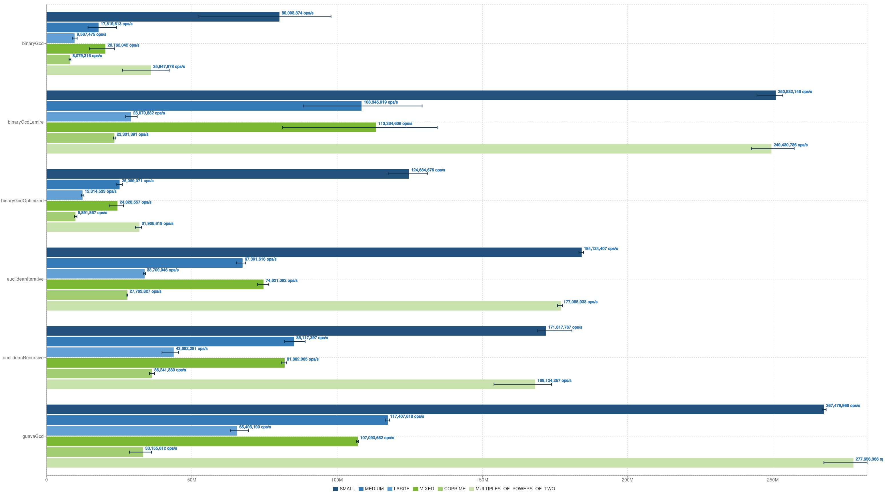

[<- _Back_](./)

## GCD Performance Analysis
_In this article, I explain several methods for finding the greatest common divisor (GCD) of two integers and provide their implementations in Java. A performance comparison follows._

### Euclidean algorithm

Recursive version:
```java
    int euclideanGcdRecursive(int a, int b) {
        if (b == 0) {
            return a;
        }
        return euclideanGcdRecursive(b, a % b);
    }
```

Iterative version:
```java
    int euclideanGcdIterative(int a, int b) {
        while (b != 0) {
            int temp = b;
            b = a % b;
            a = temp;
        }
        return a;
    }
```

### Binary GCD algorithm (Stein's algorithm)
The following pseudocode is based on the algorithm described on this [NIST page](https://xlinux.nist.gov/dads/HTML/binaryGCD.html).

```
1. if a is 0 then return b
2. if b is 0 then return a 
3. g = 1
4. while a is even and b is even
        a = a/2
        b = b/2
        g = 2*g
   (after this loop, at least one of a and b is odd.)
5. while a > 0
        if a is even, a = a/2
        else if b is even, b = b/2
        else
            c = |a-b|/2
            if a < b, then b = c else a = c 
6. return b*g 
```
Here's a straightforward Java implementation of the algorithm described above:

```java
    int binaryGcd(int a, int b) {
        if (a == 0) {
            return b;
        }
        if (b == 0) {
            return a;
        }
        int g = 1;
        while (a % 2 == 0 && b % 2 == 0) {
            a /= 2;
            b /= 2;
            g *= 2;
        }
        while (a > 0) {
            if (a % 2 == 0) {
                a /= 2;
            } else if (b % 2 == 0) {
                b /= 2;
            } else {
                int c = Math.abs(a - b) / 2;
                if (a < b) {
                    b = c;
                } else {
                    a = c;
                }
            }
        }
        return b * g;
    }
```
What can be optimized in this implementation? Division/multiplication by 2 operations can be replaced with binary shifts. Modulo operations involve division under the hood, so replacing the parts checking if a number is even (e.g. ```a % 2 == 0```) with bitwise AND operation (e.g. ```(a & 1) == 0```) sounds good. Applying those ideas, we get the following implementation:

```java
    int binaryGcdOptimized(int a, int b) {
        if (a == 0) {
            return b;
        }
        if (b == 0) {
            return a;
        }
        int g = 1;
        while ((a & 1) == 0 && (b & 1) == 0) {
            a >>= 1;
            b >>= 1;
            g <<= 1;
        }
        while (a > 0) {
            if ((a & 1) == 0) {
                a >>= 1;
            } else if ((b & 1) == 0) {
                b >>= 1;
            } else {
                int c = Math.abs(a - b) >> 1;
                if (a < b) {
                    b = c;
                } else {
                    a = c;
                }
            }
        }
        return b * g;
    }
```
And here's a Java implementation of binary GCD algorithm based on the C++ implementation and optimization ideas from [Daniel Lemire's blog post](https://lemire.me/blog/2013/12/26/fastest-way-to-compute-the-greatest-common-divisor).
```java
    int binaryGcdLemire(int a, int b) {
        if (a == 0) {
            return b;
        }
        if (b == 0) {
            return a;
        }
        int trailingZerosA = Integer.numberOfTrailingZeros(a);
        int trailingZerosB = Integer.numberOfTrailingZeros(b);
        int shift = Math.min(trailingZerosA, trailingZerosB);
        a >>= trailingZerosA;
        do {
            b >>= trailingZerosB;
            int diff = b - a;
            trailingZerosB = Integer.numberOfTrailingZeros(diff);
            if (diff == 0) {
                break;
            }
            if (b < a) {
                a = b;
            }
            b = Math.abs(diff);
        } while (true);
        return a << shift;
    }
```
Denote that, ```Integer.numberOfTrailingZeros(int)``` in Java is functionally equivalent to ```__builtin_ctz(unsigned int)``` in C++. They return the number of trailing zero bits in the binary representation of a given integer.

[Guava](https://github.com/google/guava/blob/caa005c44c53f527df251d5d9a9bef6fb8ff361c/guava/src/com/google/common/math/IntMath.java)'s implementation of binary GCD algorithm is as follows.

```java
  int gcd(int a, int b) {
    /*
     * The reason we require both arguments to be >= 0 is because otherwise, what do you return on
     * gcd(0, Integer.MIN_VALUE)? BigInteger.gcd would return positive 2^31, but positive 2^31 isn't
     * an int.
     */
    checkNonNegative("a", a);
    checkNonNegative("b", b);
    if (a == 0) {
      // 0 % b == 0, so b divides a, but the converse doesn't hold.
      // BigInteger.gcd is consistent with this decision.
      return b;
    } else if (b == 0) {
      return a; // similar logic
    }
    /*
     * Uses the binary GCD algorithm; see http://en.wikipedia.org/wiki/Binary_GCD_algorithm. This is
     * >40% faster than the Euclidean algorithm in benchmarks.
     */
    int aTwos = Integer.numberOfTrailingZeros(a);
    a >>= aTwos; // divide out all 2s
    int bTwos = Integer.numberOfTrailingZeros(b);
    b >>= bTwos; // divide out all 2s
    while (a != b) { // both a, b are odd
      // The key to the binary GCD algorithm is as follows:
      // Both a and b are odd. Assume a > b; then gcd(a - b, b) = gcd(a, b).
      // But in gcd(a - b, b), a - b is even and b is odd, so we can divide out powers of two.

      // We bend over backwards to avoid branching, adapting a technique from
      // http://graphics.stanford.edu/~seander/bithacks.html#IntegerMinOrMax

      int delta = a - b; // can't overflow, since a and b are nonnegative

      int minDeltaOrZero = delta & (delta >> (Integer.SIZE - 1));
      // equivalent to Math.min(delta, 0)

      a = delta - minDeltaOrZero - minDeltaOrZero; // sets a to Math.abs(a - b)
      // a is now nonnegative and even

      b += minDeltaOrZero; // sets b to min(old a, b)
      a >>= Integer.numberOfTrailingZeros(a); // divide out all 2s, since 2 doesn't divide b
    }
    return a << min(aTwos, bTwos);
  }
```

### Correctness of the GCD implementations

Before jumping into the performance analysis, let’s ensure that these six GCD calculation methods produce correct and consistent results. Unit tests will help achieve that.

```java
import com.google.common.math.IntMath;
import org.junit.jupiter.api.DisplayName;
import org.junit.jupiter.api.Test;
import org.junit.jupiter.params.ParameterizedTest;
import org.junit.jupiter.params.provider.CsvSource;
import org.junit.jupiter.params.provider.ValueSource;

import java.util.Random;

import static org.junit.jupiter.api.Assertions.assertEquals;
import static org.junit.jupiter.api.Assertions.assertTrue;

class GcdTest {
    @ParameterizedTest
    @CsvSource({
            "48, 18, 6",
            "100, 25, 25",
            "17, 13, 1",
            "1024, 512, 512",
            "97, 89, 1",
            "252, 105, 21",
            "1071, 462, 21"
    })
    @DisplayName("Known GCD values")
    void knownValues(int a, int b, int expectedGcd) {
        assertEquals(expectedGcd, Gcd.euclideanGcdRecursive(a, b));
        assertEquals(expectedGcd, Gcd.euclideanGcdIterative(a, b));
        assertEquals(expectedGcd, Gcd.binaryGcd(a, b));
        assertEquals(expectedGcd, Gcd.binaryGcdOptimized(a, b));
        assertEquals(expectedGcd, Gcd.binaryGcdLemire(a, b));
    }

    @Test
    @DisplayName("Edge cases")
    void edgeCases() {
        assertAllMethodsReturnSameResults(0, 5);
        assertAllMethodsReturnSameResults(7, 0);
        assertAllMethodsReturnSameResults(1, 100);
        assertAllMethodsReturnSameResults(50, 1);
        assertAllMethodsReturnSameResults(42, 42);
    }

    @Test
    @DisplayName("Random values")
    void randomValues() {
        Random random = new Random(12345); // Fixed seed for reproducibility
        for (int i = 0; i < 1000; i++) {
            int a = random.nextInt(10000) + 1;
            int b = random.nextInt(10000) + 1;
            assertAllMethodsReturnSameResults(a, b);
        }
    }

    @ParameterizedTest
    @ValueSource(ints = {2, 4, 8, 16, 32, 64, 128, 256, 512, 1024})
    @DisplayName("Powers of 2")
    void powersOfTwo(int power) {
        assertAllMethodsReturnSameResults(power, power / 2);
        assertAllMethodsReturnSameResults(power, power * 3);
        assertAllMethodsReturnSameResults(power, 7);
    }

    @Test
    @DisplayName("Large numbers")
    void largeNumbers() {
        assertAllMethodsReturnSameResults(1000000, 999999);
        assertAllMethodsReturnSameResults(524288, 262144);
        assertAllMethodsReturnSameResults(999983, 999979);
    }

    @Test
    @DisplayName("Performance sanity check")
    void performanceSanityCheck() {
        long startTime = System.currentTimeMillis();
        assertAllMethodsReturnSameResults(Integer.MAX_VALUE, Integer.MAX_VALUE - 1);
        assertAllMethodsReturnSameResults((int) Math.pow(2, 30), (int) Math.pow(2, 29));
        long endTime = System.currentTimeMillis();
        long duration = endTime - startTime;
        assertTrue(duration < 1000, "GCD calculations took too long: " + duration + "ms");
    }

    private void assertAllMethodsReturnSameResults(int a, int b) {
        int euclideanGcdRecursive = Gcd.euclideanGcdRecursive(a, b);
        int euclideanGcdIterative = Gcd.euclideanGcdIterative(a, b);
        int binaryGcd = Gcd.binaryGcd(a, b);
        int binaryGcdOptimized = Gcd.binaryGcdOptimized(a, b);
        int binaryGcdLemire = Gcd.binaryGcdLemire(a, b);
        int guavaGcd = IntMath.gcd(a, b);
        String message = String.format("GCD(%d, %d) - Methods disagree: euclideanGcdRecursive=%d, euclideanGcdIterative=%d,"
                        + " binaryGcd=%d, binaryGcdOptimized=%d, binaryGcdLemire=%d, guavaGcd=%d",
                a, b, euclideanGcdRecursive, euclideanGcdIterative, binaryGcd, binaryGcdOptimized, binaryGcdLemire, guavaGcd);
        assertEquals(euclideanGcdRecursive, euclideanGcdIterative, message);
        assertEquals(euclideanGcdRecursive, binaryGcd, message);
        assertEquals(euclideanGcdRecursive, binaryGcdOptimized, message);
        assertEquals(euclideanGcdRecursive, binaryGcdLemire, message);
        assertEquals(euclideanGcdRecursive, guavaGcd, message);
    }
}
```

### Benchmarking with JMH

#### Benchmarking environment
```
OS                   : Linux 6.9.3-76060903-generic (amd64)
CPU                  : 12th Gen Intel Core i7-12700H (14 cores / 20 threads)
Max Frequency (MHz)  : 4700.0000
JVM version          : JDK 21.0.7, OpenJDK 64-Bit Server VM, 21.0.7+6-Ubuntu-0ubuntu122.04
JVM options          : -Xms1g -Xmx1g
JMH version          : 1.37
Warmup               : 3 iterations, 2 s each
Measurement          : 5 iterations, 3 s each
Timeout              : 10 min per iteration
Threads              : 1 thread, will synchronize iterations
Benchmark mode       : Throughput, ops/time
```

#### Benchmarking code setup
I use various types of test data for the performance benchmarking of those 6 GCD functions described so far. Small/medium/large numbers, mixed numbers i.e. combination of small, medium and large numbers, co-prime numbers, and numbers which are divisible by some power of 2.

```java
import com.google.common.math.IntMath;
import org.openjdk.jmh.annotations.Benchmark;
import org.openjdk.jmh.annotations.BenchmarkMode;
import org.openjdk.jmh.annotations.Fork;
import org.openjdk.jmh.annotations.Level;
import org.openjdk.jmh.annotations.Measurement;
import org.openjdk.jmh.annotations.Mode;
import org.openjdk.jmh.annotations.OutputTimeUnit;
import org.openjdk.jmh.annotations.Param;
import org.openjdk.jmh.annotations.Scope;
import org.openjdk.jmh.annotations.Setup;
import org.openjdk.jmh.annotations.State;
import org.openjdk.jmh.annotations.Threads;
import org.openjdk.jmh.annotations.Warmup;

import java.util.Random;
import java.util.concurrent.TimeUnit;

@BenchmarkMode({Mode.Throughput})
@OutputTimeUnit(TimeUnit.SECONDS)
@State(Scope.Benchmark)
@Warmup(iterations = 3, time = 2, timeUnit = TimeUnit.SECONDS)
@Measurement(iterations = 5, time = 3, timeUnit = TimeUnit.SECONDS)
@Fork(value = 3, jvmArgs = {"-Xms1g", "-Xmx1g"})
@Threads(1)
public class GcdBenchmark {
    @Param({"SMALL", "MEDIUM", "LARGE", "MIXED", "COPRIME", "MULTIPLES_OF_POWERS_OF_TWO"})
    private TestDataCategory testDataCategory;
    private int[] aValues;
    private int[] bValues;
    private static final int TEST_PAIRS_COUNT = 1024;
    private static final int[] PRIMES = generateFirstNPrimes(4_000);
    private static final Random RANDOM = new Random(79);

    @State(Scope.Thread)
    public static class ThreadLocalIndex {
        int index = 0;
    }

    @Setup(Level.Trial)
    public void setup() {
        aValues = new int[TEST_PAIRS_COUNT];
        bValues = new int[TEST_PAIRS_COUNT];
        System.out.printf("Setting up test data: %s (%s)%n", testDataCategory.name(), testDataCategory.getDescription());
        switch (testDataCategory) {
            case SMALL:
                generateSmallNumbers();
                break;
            case MEDIUM:
                generateMediumNumbers();
                break;
            case LARGE:
                generateLargeNumbers();
                break;
            case MIXED:
                generateMixedNumbers();
                break;
            case COPRIME:
                generateCoprimeNumbers();
                break;
            case MULTIPLES_OF_POWERS_OF_TWO:
                generateMultiplesOfPowersOfTwo();
                break;
        }
    }

    @Benchmark
    public int euclideanRecursive(ThreadLocalIndex threadLocalIndex) {
        int index = (threadLocalIndex.index++) & (TEST_PAIRS_COUNT - 1);
        return Gcd.euclideanGcdRecursive(aValues[index], bValues[index]);
    }

    @Benchmark
    public int euclideanIterative(ThreadLocalIndex threadLocalIndex) {
        int index = (threadLocalIndex.index++) & (TEST_PAIRS_COUNT - 1);
        return Gcd.euclideanGcdIterative(aValues[index], bValues[index]);
    }

    @Benchmark
    public int binaryGcd(ThreadLocalIndex threadLocalIndex) {
        int index = (threadLocalIndex.index++) & (TEST_PAIRS_COUNT - 1);
        return Gcd.binaryGcd(aValues[index], bValues[index]);
    }

    @Benchmark
    public int binaryGcdOptimized(ThreadLocalIndex threadLocalIndex) {
        int index = (threadLocalIndex.index++) & (TEST_PAIRS_COUNT - 1);
        return Gcd.binaryGcdOptimized(aValues[index], bValues[index]);
    }

    @Benchmark
    public int binaryGcdLemire(ThreadLocalIndex threadLocalIndex) {
        int index = (threadLocalIndex.index++) & (TEST_PAIRS_COUNT - 1);
        return Gcd.binaryGcdLemire(aValues[index], bValues[index]);
    }

    @Benchmark
    public int guavaGcd(ThreadLocalIndex threadLocalIndex) {
        int index = (threadLocalIndex.index++) & (TEST_PAIRS_COUNT - 1);
        return IntMath.gcd(aValues[index], bValues[index]);
    }

    private void generateSmallNumbers() {
        for (int i = 0; i < TEST_PAIRS_COUNT; i++) {
            aValues[i] = RANDOM.nextInt(100) + 1;
            bValues[i] = RANDOM.nextInt(100) + 1;
        }
    }

    private void generateMediumNumbers() {
        for (int i = 0; i < TEST_PAIRS_COUNT; i++) {
            aValues[i] = RANDOM.nextInt(10000) + 1;
            bValues[i] = RANDOM.nextInt(10000) + 1;
        }
    }

    private void generateLargeNumbers() {
        for (int i = 0; i < TEST_PAIRS_COUNT; i++) {
            aValues[i] = RANDOM.nextInt(1000000) + 1;
            bValues[i] = RANDOM.nextInt(1000000) + 1;
        }
    }

    private void generateMixedNumbers() {
        for (int i = 0; i < TEST_PAIRS_COUNT; i++) {
            switch (RANDOM.nextInt(3)) {
                case 0 -> {
                    aValues[i] = RANDOM.nextInt(100) + 1;
                    bValues[i] = RANDOM.nextInt(100) + 1;
                }
                case 1 -> {
                    aValues[i] = RANDOM.nextInt(10_000) + 1;
                    bValues[i] = RANDOM.nextInt(10_000) + 1;
                }
                case 2 -> {
                    aValues[i] = RANDOM.nextInt(1_000_000) + 1;
                    bValues[i] = RANDOM.nextInt(1_000_000) + 1;
                }
            }
        }
    }

    private void generateCoprimeNumbers() {
        for (int i = 0; i < TEST_PAIRS_COUNT; i++) {
            int indexOfPrime = RANDOM.nextInt(PRIMES.length - 3);
            aValues[i] = PRIMES[indexOfPrime] * PRIMES[indexOfPrime + 1];
            bValues[i] = PRIMES[indexOfPrime + 2] * PRIMES[indexOfPrime + 3];
        }
    }

    private void generateMultiplesOfPowersOfTwo() {
        for (int i = 0; i < TEST_PAIRS_COUNT; i++) {
            int powerA = RANDOM.nextInt(20) + 1;
            int powerB = RANDOM.nextInt(20) + 1;
            int multiplierA = (RANDOM.nextInt(100) + 1);
            int multiplierB = (RANDOM.nextInt(100) + 1);
            aValues[i] = (1 << powerA) * multiplierA;
            bValues[i] = (1 << powerB) * multiplierB;
        }
    }

    private static int[] generateFirstNPrimes(int n) {
        int[] result = new int[n];
        int number = 2;
        int index = 0;
        while (index < n) {
            if (IntMath.isPrime(number)) {
                result[index++] = number;
            }
            number++;
        }
        return result;
    }

    public enum TestDataCategory {
        SMALL("Numbers 1-100"),
        MEDIUM("Numbers 1-10,000"),
        LARGE("Numbers 1-1,000,000"),
        MIXED("Mixed small/medium/large"),
        COPRIME("Coprime pairs (GCD=1)"),
        MULTIPLES_OF_POWERS_OF_TWO("Multiples of powers of 2");

        private final String description;

        TestDataCategory(String description) {
            this.description = description;
        }

        public String getDescription() {
            return description;
        }
    }
}
```
#### Benchmarking results
```
Runtime: 38 minutes 9 seconds

Benchmark                   (testDataCategory)   Mode  Cnt          Score          Error  Units
binaryGcd                                SMALL  thrpt   15   80093873.958 ± 21598842.550  ops/s
binaryGcd                               MEDIUM  thrpt   15   17819613.416 ±  4413404.244  ops/s
binaryGcd                                LARGE  thrpt   15    9567475.056 ±   725753.987  ops/s
binaryGcd                                MIXED  thrpt   15   20162041.959 ±  4193874.599  ops/s
binaryGcd                              COPRIME  thrpt   15    8079315.863 ±   263211.444  ops/s
binaryGcd           MULTIPLES_OF_POWERS_OF_TWO  thrpt   15   35847878.254 ±  7404436.967  ops/s
binaryGcdLemire                          SMALL  thrpt   15  250932146.168 ±  2115387.421  ops/s
binaryGcdLemire                         MEDIUM  thrpt   15  108345918.881 ± 10938982.071  ops/s
binaryGcdLemire                          LARGE  thrpt   15   28970832.010 ±  1344796.463  ops/s
binaryGcdLemire                          MIXED  thrpt   15  113334606.186 ± 14236010.646  ops/s
binaryGcdLemire                        COPRIME  thrpt   15   23301390.698 ±   239699.338  ops/s
binaryGcdLemire     MULTIPLES_OF_POWERS_OF_TWO  thrpt   15  249430736.491 ±  5927818.357  ops/s
binaryGcdOptimized                       SMALL  thrpt   15  124634675.892 ±  5527667.667  ops/s
binaryGcdOptimized                      MEDIUM  thrpt   15   25069070.741 ±   858523.595  ops/s
binaryGcdOptimized                       LARGE  thrpt   15   12314533.497 ±   319010.967  ops/s
binaryGcdOptimized                       MIXED  thrpt   15   24328557.052 ±  2182081.430  ops/s
binaryGcdOptimized                     COPRIME  thrpt   15    9891866.846 ±   316097.230  ops/s
binaryGcdOptimized  MULTIPLES_OF_POWERS_OF_TWO  thrpt   15   31905618.950 ±   909187.425  ops/s
euclideanIterative                       SMALL  thrpt   15  184124406.817 ±   619064.913  ops/s
euclideanIterative                      MEDIUM  thrpt   15   67391615.575 ±   894162.038  ops/s
euclideanIterative                       LARGE  thrpt   15   33709946.202 ±   211044.561  ops/s
euclideanIterative                       MIXED  thrpt   15   74621091.918 ±  1309003.818  ops/s
euclideanIterative                     COPRIME  thrpt   15   27762826.762 ±    75320.470  ops/s
euclideanIterative  MULTIPLES_OF_POWERS_OF_TWO  thrpt   15  177085933.434 ±   579951.675  ops/s
euclideanRecursive                       SMALL  thrpt   15  171817766.717 ±  3601958.600  ops/s
euclideanRecursive                      MEDIUM  thrpt   15   85117396.819 ±  2294969.999  ops/s
euclideanRecursive                       LARGE  thrpt   15   43682280.831 ±  1568800.268  ops/s
euclideanRecursive                       MIXED  thrpt   15   81862065.203 ±   711692.397  ops/s
euclideanRecursive                     COPRIME  thrpt   15   36241379.984 ±   570170.584  ops/s
euclideanRecursive  MULTIPLES_OF_POWERS_OF_TWO  thrpt   15  168124256.670 ±  6360404.297  ops/s
guavaGcd                                 SMALL  thrpt   15  267479968.138 ±   435308.620  ops/s
guavaGcd                                MEDIUM  thrpt   15  117407617.637 ±   487596.182  ops/s
guavaGcd                                 LARGE  thrpt   15   65493190.379 ±  2083317.443  ops/s
guavaGcd                                 MIXED  thrpt   15  107093681.790 ±   183118.261  ops/s
guavaGcd                               COPRIME  thrpt   15   33155612.258 ±  3383485.098  ops/s
guavaGcd            MULTIPLES_OF_POWERS_OF_TWO  thrpt   15  277656366.472 ±  6692938.959  ops/s
```
The visualization below is generated via [JMH Visualizer](https://jmh.morethan.io).


### Conclusion
* Highly optimized binary GCD algorithms, i.e. Guava's GCD and Lemire's GCD achieve the highest throughput compared to the other GCD implementations. In general, Guava’s GCD is faster because it uses branchless techniques that improve CPU pipeline efficiency and branch prediction. It avoids some method calls and uses bitwise arithmetic that JIT compiles into fewer, faster instructions.
* Next, Euclidian GCD versions come. Notice that iterative and recursive versions of Euclidian GCD achieved close results. However, iterative version performs better. This can be explained with limited tail-call optimization (TCO) in JVM. The JVM doesn't reliably perform tail-call optimization, which means recursive calls aren’t transformed into jumps internally. So recursive calls still accumulate stack frames and overhead.
* Plain binary GCD and its slightly optimized version achieved the lowest throughput. The optimized binary GCD performed better than the plain version due to reduced division and multiplication operations; nevertheless, both are nowhere near the performance of the other four GCD implementations.
* One final caveat: All of the GCD implementations above — except for Guava's — do not check whether the given integer values are non-negative. I’ve omitted that check for simplicity, but ideally, the following lines can be added at the beginning of those methods:
```java
a = Math.abs(a);
b = Math.abs(b);
```
